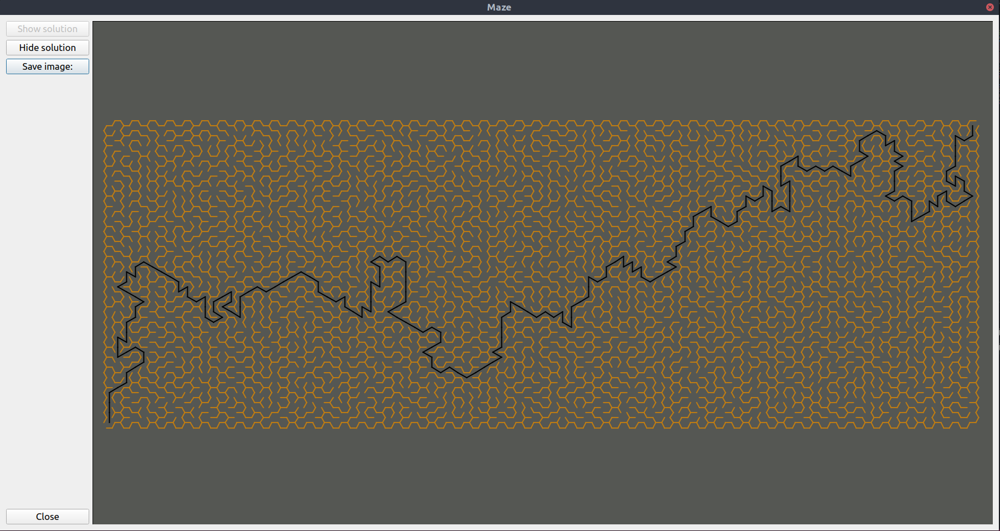
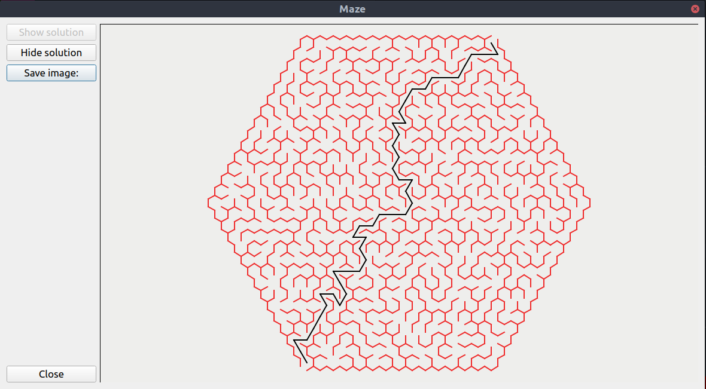
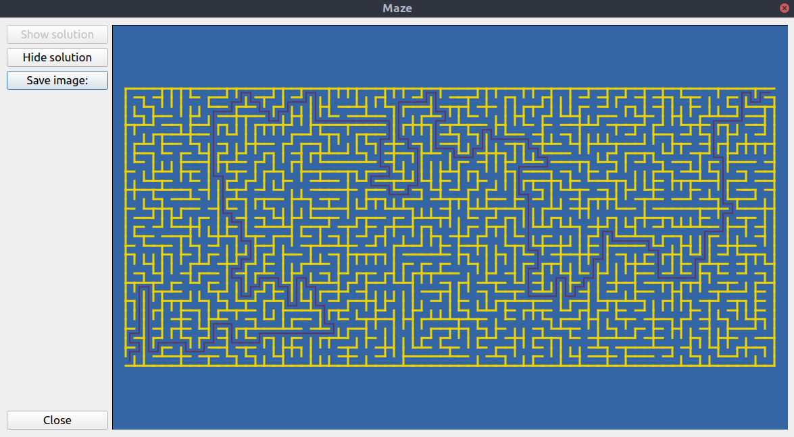
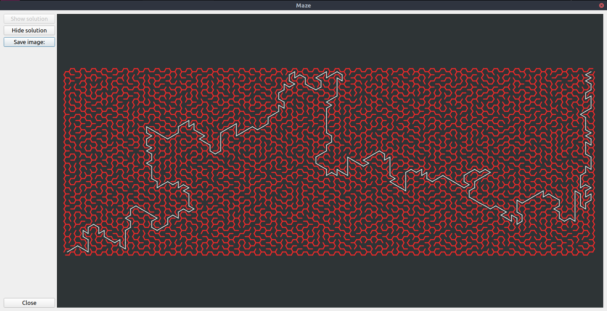
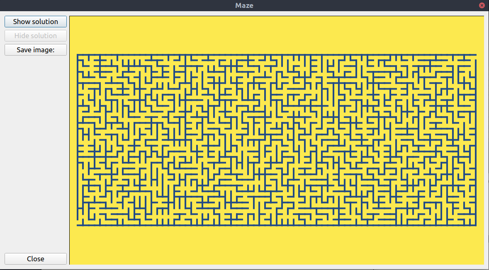

# MERATOR
Merator is a simple Maze generator application build with Qt.
The app can build mazes with different algorithms and provide soulutions for them.

Build algorithms:
- BFS
- DFS(with some modification)
- Prim
- Kruscal
- Loop-erased walk (Default)

Find path algorithms:
- BFS 
- DFS
- Astar (Default)

There are also different shapes for mazes:
- Rectangle
- Honey Comb
- Rectangle-comb maze (Default)

## Examples

